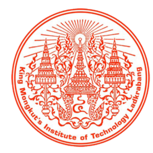

# Welcome! My name is Jeff 

---

## 
💡 Get to Know Me 💡

I am a <u>**_passionate_**</u> and <u>**_goal-oriented_**</u> individual, in pursuit of knowledge for personal development.

I believe in continuously expanding my knowledge and staying up-to-date with emerging trends and best practices in the field.

 

## 
💻 Programming Languages 💻

 

 
 
 
 
 

 

 

## 
✨ Experiences ✨

  
  
I am studying in my second year for a Bachelor's degree in Software Engineering, at King Mongkut's Institute of Technology Ladkrabang.

 
 

 